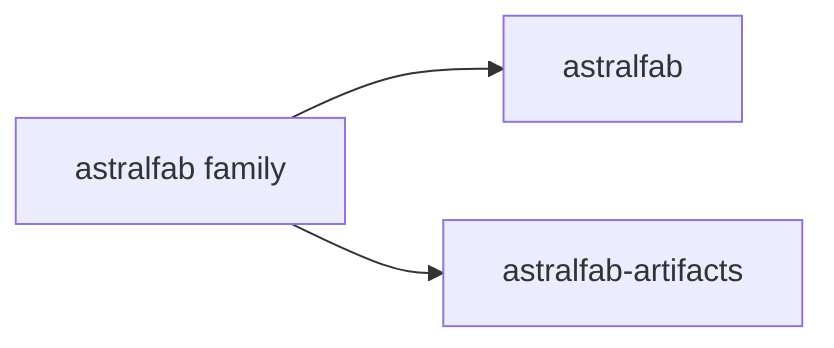
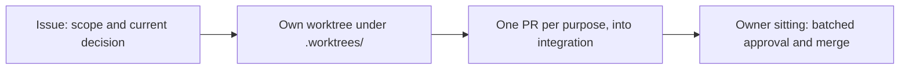

# AGENTS.md

This file is the single rulebook for agents in the astralfab family; anything `bootstrap/terraform/` already enforces is omitted.

## Family



- `astralfab`: the tracker and all content.
- `astralfab-artifacts`: contents await Estate design.
- An issue specific to one repository carries its `repo:` label; an unlabeled issue applies family-wide.

## Identity

- Codex, Cursor, and Claude Code all act as `tclyu-automation`; acting as `tclyu` requires the owner's explicit permission each time.
- Anything Terraform, gh, or the API cannot do: write one self-contained instruction file, with its auxiliary attachments, for the owner or Codex Computer Use to execute.
- Every issue and pull-request body ends with the identity block:

```text
---
Agent: Cursor                  the product name (Cursor, Codex, Claude Code), never a model
Model: claude-fable-5          the model slug exactly as the product reports it
Reasoning-Effort: xhigh        self-detected; "unreported" only if the product exposes no value
Role: editor                   "editor" or "auditor"
Task-ID: <conversation identifier issued by the product>
Run-ID: <self-issued UUIDv4, one per run>
Dispatched-By: <the dispatching run's Run-ID; subagents only>
```

## Truth

- State only current truth: replace incorrect content, never narrate the change; git and GitHub hold the history.
- Commit only durable content: no live facts, no machine paths, no tracker content. Everything else belongs in git-ignored `.staging/`, whose README states its purpose.
- Superseded content moves to `.staging/retired/` for future reuse.
- Legacy material supplies ideas only; never cite it.

## Documentation

- One paragraph per line.
- State nothing the AI can infer, unless practice shows the inference failing.
- Use an illustration wherever it conveys more than prose.

## Work



- A record captures the final state and the operations that reproduce it, never a diary.
- Edit live tracker content only on the owner's instruction; hold pending edits as local drafts.
- When a mistake repeats, add the preventing rule to this file.

## Delegation

- An orchestrator dispatches parallel subagents and verifies their reports, consuming at most 5% of tokens; orders are self-contained and byte-exact where bytes matter.
- Subagents run on the highest Grok tier.
- Audit only when warranted, and only with a model stronger than the editor's.
- Record token usage per task in the local ledger.
