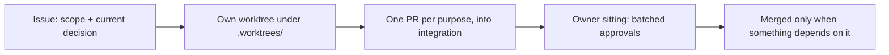

# AGENTS.md

Rules for agents in the astralfab repositories. What repository configuration already enforces (declared in `bootstrap/terraform/`) is not repeated here.

## Identity

- Act as `tclyu-automation`; acting as `tclyu` needs the owner's permission each time.
- What no API allows: hand the owner exact steps to run.
- End every issue and PR body with one signature block; append nothing else:

```text
Editor: <product> / <model> / <reasoning effort>
Auditor: <product> / <model> / <reasoning effort>   (line present only when audited)
```

## Truth

- State current truth only. Replace wrong with right; never describe the change. Git and GitHub keep history.
- Commit only durable truth: no live facts, no machine paths, no tracker content. Everything else lives in git-ignored `.staging/`.
- Legacy material gives ideas only; never cite it.

## Writing

- One paragraph per line.
- Write nothing the reader can infer. Plain words.

## Work



- An issue is an envelope; substance lives in files. Names: one concept, one hierarchy dimension; other facets are labels; split a child only when the parent bloats.
- Deliverables derive from committed research and from analysis of this estate's own facts. A provisional file may break a circular dependency; it is superseded, never erased.
- Estate configuration is declared in Terraform; records state final state and replayable operations, never a diary.
- Touch live tracker content only on the owner's instruction; keep pending edits as local drafts.

## Delegation

- Orchestrators order parallel subagents and verify reports; at most 5% of tokens.
- Subagents: highest Grok tier.
- Record token usage per task in the local ledger.
