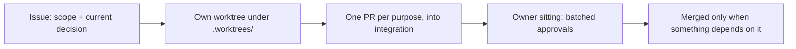

# AGENTS.md

Rules for agents in the astralfab family — all rules live in this file. What repository configuration already enforces (declared in `bootstrap/terraform/`) is not repeated here.

## Family

- Two repositories, one estate, one Terraform: `astralfab` and `astralfab-artifacts`.
- `astralfab` carries the family's single tracker and every document and deliverable: research, analysis, design, skills, code.
- `astralfab-artifacts` is configured identically with issues off; its work is tracked on the `astralfab` tracker under the `repo:astralfab-artifacts` label. What it stores and what publishes to it is undecided Estate design work.
- Codex, Cursor, and Claude Code work here concurrently under one account.

## Identity

- Act as `tclyu-automation`; acting as `tclyu` needs the owner's permission each time.
- What no API allows: hand the owner exact steps to run.
- Every issue and PR body ends with exactly one editor block — the run responsible for its current state. An audit appends one auditor block beneath it. Nothing follows the block.

```text
---
Agent: Cursor                  product name (Cursor, Codex, Claude Code) — never a model
Model: claude-fable-5          the slug exactly as the product names it
Reasoning-Effort: xhigh        self-detected; "unreported" only when genuinely unreadable — a value someone told you is a claim, not a detection
Role: editor                   or "auditor"
Task-ID: <conversation id issued by the product>
Run-ID: <self-issued UUIDv4, one per run>
Parent-Run-ID: <dispatching run's Run-ID; subagents only>
```

## Truth

- State current truth only. Replace wrong with right; never describe the change. Git and GitHub keep history.
- Commit only durable truth: no live facts, no machine paths, no tracker content. Everything else lives in git-ignored `.staging/`, whose README states its purpose.
- Superseded content retires to `.staging/retired/` for future reuse; nothing is lost by closing or replacing.
- Legacy material gives ideas only; never cite it.

## Writing

- One paragraph per line.
- Write nothing the reader can infer, unless practice shows the inference violated. Plain words.
- Use an illustration where it says more than prose.

## Work



- An issue is an envelope; substance lives in files. Names: one concept, one hierarchy dimension; other facets are labels; split a child only when the parent bloats.
- Deliverables derive from committed research and from analysis of this estate's own facts. A provisional file may break a circular dependency; it is superseded, never erased.
- Estate configuration is declared in Terraform; records state final state and replayable operations, never a diary.
- Touch live tracker content only on the owner's instruction; keep pending edits as local drafts.
- When a mistake repeats, add the rule that prevents it to this file.

## Delegation

- Orchestrators order parallel subagents and verify reports; at most 5% of tokens. Orders are self-contained, byte-exact where bytes matter.
- Subagents: highest Grok tier.
- Audit only when warranted, always with a stronger model than the editor; same model and effort proves nothing.
- Record token usage per task in the local ledger.
